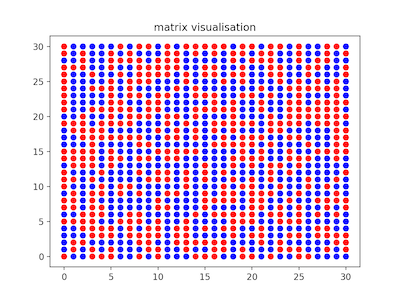

## Binary Random Number Generator Tests (RNGbin-tests)

Simple randomness tests for a binary numbers sequence designed for educational purposes.

| test | description | example |
| -- | -- | -- |
| rngbin_matrixvisualization(rnd_seq)  | visualize random string as a matrix  |  |

