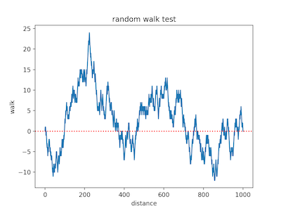

## Binary Random Number Generator Tests (RNGbin-tests)

Simple, self-contained randomness tests for a binary numbers sequence. Tests are designed for educational purposes.

| Test | Description | Example |
| -- | -- | -- |
| matrix_visualization(rnd_seq)  | Visualize a random string as a matrix. No  patterns should be visible. |  |
| random_walk(rnd_seq)  | A random walk is the walk on the integer number line which starts at 0, and at each step moves -1 for bit 0 or +1 for bit 1. For a random sequence, the random walk should be near zero.  |  |
| digits_frequency(rnd_seq)  | Shows and returns relative frequency of digits 0 and 1. Frequencies should be close to 0.5/0.5 |  |
| spectral(rnd_seq,plot=True)  | Detect repetitive patterns that are near each other that would indicate a deviation from the assumption of randomness. Returns p-value indicating whether the number of peaks exceeding the 95% threshold is significantly different than 5%. |  |

